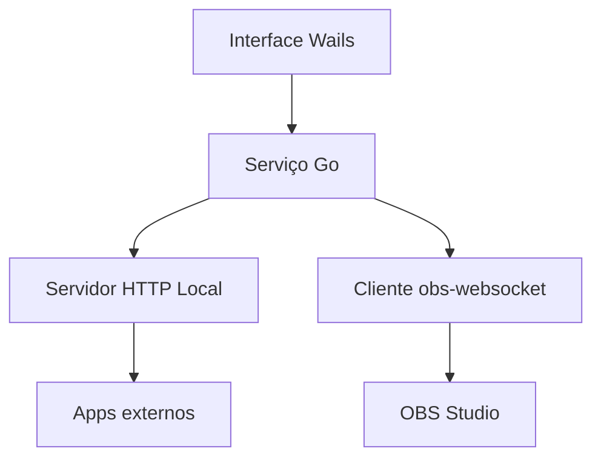

A ideia é criar um aplicativo desktop leve, feito em **Go + Wails**, que roda na máquina local e serve como uma “ponte” entre aplicações externas e o **OBS Studio**. Ele teria uma interface simples para controlar o servidor local, configurar porta, conexão com OBS e acompanhar status.

**Objetivo Da Aplicação**

Criar uma aplicação servidora local para comunicação com o OBS Studio, executando em `localhost`, com uma interface desktop para gerenciamento básico do serviço.

Exemplo de uso:

```txt
Aplicação Web / Mobile / Plugin
        ↓
Servidor Local em Go
        ↓
OBS Studio via obs-websocket
```

A aplicação ficaria instalada no computador onde o OBS está rodando.

**Stack Sugerida**

| Camada                   | Tecnologia               |
| ------------------------ | ------------------------ |
| Desktop app              | Wails                    |
| Backend local            | Go                       |
| Interface                | React + TypeScript       |
| Comunicação com OBS      | obs-websocket            |
| API local                | HTTP REST e/ou WebSocket |
| Configuração persistente | JSON local ou SQLite     |
| Build instalável         | Wails build              |

**Funcionalidades Principais**

1. **Servidor Local**

A aplicação deve iniciar um servidor local em uma porta configurável.

Exemplo:

```txt
http://localhost:3456
```

Esse servidor pode expor endpoints para controlar o OBS:

```txt
GET  /health
POST /obs/connect
POST /obs/disconnect
POST /obs/scene
POST /obs/source/show
POST /obs/source/hide
POST /obs/recording/start
POST /obs/recording/stop
POST /obs/stream/start
POST /obs/stream/stop
```

Também pode ter WebSocket para eventos em tempo real:

```txt
ws://localhost:3456/events
```

2. **Comunicação Com OBS Studio**

A aplicação deve se conectar ao OBS usando o plugin nativo atual do OBS, o **obs-websocket**, que normalmente roda em:

```txt
ws://localhost:4455
```

Configurações necessárias:

| Campo         | Exemplo               |
| ------------- | --------------------- |
| Host OBS      | `localhost`           |
| Porta OBS     | `4455`                |
| Senha OBS     | senha definida no OBS |
| Auto conectar | sim/não               |

A aplicação deve conseguir:

- Conectar e desconectar do OBS.
- Verificar se o OBS está aberto.
- Listar cenas.
- Trocar cena ativa.
- Listar fontes da cena.
- Mostrar ou ocultar fonte.
- Iniciar/parar gravação.
- Iniciar/parar transmissão.
- Consultar status atual do OBS.

3. **Tela Principal**

A tela inicial pode mostrar um painel simples:

```txt
Status do Servidor: Online
Porta: 3456
Status do OBS: Conectado
Cena Atual: Culto Ao Vivo
Gravação: Inativa
Transmissão: Ativa
```

Ações rápidas:

- Iniciar servidor
- Parar servidor
- Reiniciar servidor
- Conectar ao OBS
- Desconectar do OBS
- Testar conexão
- Abrir logs

4. **Tela De Configurações**

Campos básicos:

| Configuração                     | Descrição                                       |
| -------------------------------- | ----------------------------------------------- |
| Porta do servidor local          | Porta HTTP/WebSocket da aplicação               |
| Iniciar servidor automaticamente | Sobe o servidor ao abrir o app                  |
| Host do OBS                      | Normalmente `localhost`                         |
| Porta do OBS                     | Normalmente `4455`                              |
| Senha do OBS                     | Senha do obs-websocket                          |
| Reconectar automaticamente       | Tentar reconectar caso o OBS feche              |
| Permitir origem externa          | Define se aceita apenas localhost ou rede local |
| Token de segurança               | Proteção para chamadas externas                 |

Importante: por padrão, eu deixaria o servidor aceitando apenas chamadas de `localhost`, por segurança.

5. **Tela De Logs**

A aplicação deve ter uma área para acompanhar eventos:

```txt
[19:42:01] Servidor iniciado na porta 3456
[19:42:05] Conectado ao OBS em localhost:4455
[19:42:09] Cena alterada para "Abertura"
[19:42:22] Gravação iniciada
[19:44:10] Cliente externo conectado
```

Filtros úteis:

- Todos
- Servidor
- OBS
- Erros
- Requisições

6. **Segurança**

Mesmo rodando localmente, é importante proteger a aplicação.

Recomendações:

- Por padrão, escutar apenas em `127.0.0.1`.
- Permitir rede local somente se o usuário ativar.
- Usar token/API key para chamadas HTTP.
- Não exibir a senha do OBS em texto aberto.
- Salvar senha de forma segura quando possível.
- Bloquear comandos perigosos se não autenticado.

Exemplo de chamada protegida:

```http
POST http://localhost:3456/obs/scene
Authorization: Bearer MEU_TOKEN_LOCAL
```

Body:

```json
{
  "sceneName": "Camera Principal"
}
```

**Arquitetura Proposta**



**Estrutura De Pastas Sugerida**

```txt
obs-local-server/
├── frontend/
│   ├── src/
│   │   ├── pages/
│   │   ├── components/
│   │   └── services/
├── internal/
│   ├── config/
│   ├── server/
│   ├── obs/
│   ├── logs/
│   └── security/
├── main.go
├── app.go
├── wails.json
└── README.md
```

**Módulos Do Backend**

| Módulo     | Responsabilidade                        |
| ---------- | --------------------------------------- |
| `config`   | Carregar e salvar configurações         |
| `server`   | Subir/parar/reiniciar servidor HTTP     |
| `obs`      | Conectar e controlar OBS via WebSocket  |
| `logs`     | Registrar eventos da aplicação          |
| `security` | Validar token/API key                   |
| `app`      | Expor métodos Go para a interface Wails |

**Fluxo Inicial Da Aplicação**

1. Usuário abre o aplicativo.
2. App carrega configurações salvas.
3. Se `autoStartServer = true`, inicia servidor local.
4. Se `autoConnectOBS = true`, tenta conectar ao OBS.
5. Interface mostra status do servidor e do OBS.
6. Usuário pode alterar porta, reiniciar servidor e testar conexão.

**MVP Recomendado**

Primeira versão com o essencial:

- App desktop em Wails.
- Tela principal com status.
- Configuração de porta do servidor.
- Botões start/stop/restart.
- Configuração de host, porta e senha do OBS.
- Teste de conexão com OBS.
- Endpoint para trocar cena.
- Logs básicos.

Endpoints do MVP:

```txt
GET  /health
GET  /obs/status
GET  /obs/scenes
POST /obs/scene
POST /server/restart
```

**Versão 2**

Depois do MVP, adicionar:

- Controle de gravação.
- Controle de transmissão.
- Mostrar/ocultar fontes.
- WebSocket para eventos em tempo real.
- Autostart com o sistema operacional.
- Minimizar para bandeja.
- Controle via rede local.
- Perfil de configuração por ambiente.

**Versão 3**

Recursos mais avançados:

- Macros simples.
- Atalhos globais.
- Integração com Stream Deck.
- Controle PTZ se a câmera suportar protocolo/IP.
- Dashboard web local.
- Permissões por token.
- Histórico de comandos executados.

**Exemplo De Configuração**

```json
{
  "server": {
    "host": "127.0.0.1",
    "port": 3456,
    "autoStart": true,
    "allowLan": false,
    "apiToken": "token-gerado-automaticamente"
  },
  "obs": {
    "host": "localhost",
    "port": 4455,
    "password": "",
    "autoConnect": true,
    "autoReconnect": true
  }
}
```

**Prioridade De Desenvolvimento**

1. Criar projeto Wails com React + TypeScript.
2. Criar módulo de configuração local.
3. Criar servidor HTTP em Go com start/stop/restart.
4. Criar tela de configurações do servidor.
5. Integrar com obs-websocket.
6. Criar tela de conexão com OBS.
7. Criar endpoints REST para comandos básicos.
8. Criar sistema simples de logs.
9. Gerar build instalável para Windows.
10. Testar com OBS real rodando na máquina.

**Resumo Do Produto**

Você estaria criando uma espécie de **OBS Local Control Server**: um aplicativo instalável, leve, feito em Go + Wails, que roda junto com o OBS e permite que outras aplicações controlem cenas, fontes, gravação e transmissão por uma API local segura.

Para o seu caso, eu começaria pelo MVP com **controle de cenas + servidor local configurável + conexão OBS**, porque isso já valida o coração da aplicação sem deixar o projeto grande demais logo no começo.
